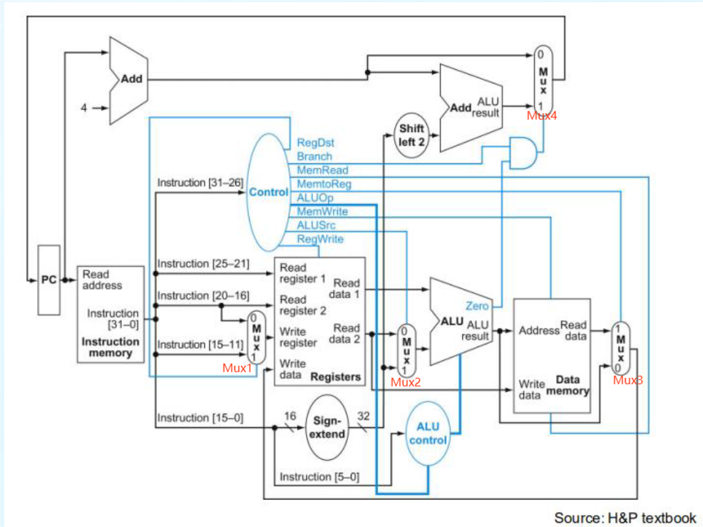

# Simple CPU
## Simple CPU Structure



## Content

[TOC]


## Modules

### Top

#### Description

​	The top module.

#### Bus

| Name                           | Type   | Width  | From/To          | Description                       |
| ------------------------------ | ------ | ------ | ---------------- | --------------------------------- |
| raw_clock                      | input  | 1      | **Hardware**     | The 100MHz clock.                 |
| hard_ware_rst                  | input  | 1      | **Hardware**     | The reset signal.                 |
| data_switch                    | input  | [7:0]  | **Hardware**     | To read data.                     |
| exam_data                      | input  | [2:0]  | **Hardware**     | To select test examples.          |
| confirm_button                 | input  | 1      | **Hardware**     | To confirm something.             |
| block_led                      | output | 1      | **Hardware**     | To represent the block signal.    |
| error_led                      | output | 1      | **Hardware**     | To represent error like overflow. |
| result_led                     | output | 1      | **Hardware**     | To represent something.           |
| seg_en                         | output | [7:0]  | **Hardware**     | The segment led enable signals.   |
| seg_out0                       | output | [7:0]  | **Hardware**     | The segment led data.             |
| seg_out1                       | output | [7:0]  | **Hardware**     | The segment led data.             |
| clk23                          | wire   | 1      | **IPCore** ipclk | 23MHz.                            |
| pc_output_address_o            | wire   | [31:0] |                  | Receive output from PC.           |
| ifetch_instruction_o           | wire   | [31:0] |                  | Receive output from IFetch.       |
| controller_RegDst              | wire   | 1      |                  | Receive output from Controller.   |
| controller_Branch              | wire   | [1:0]  |                  | Receive output from Controller.   |
| controller_MemRead             | wire   | 1      |                  | Receive output from Controller.   |
| controller_MemtoReg            | wire   | 1      |                  | Receive output from Controller.   |
| controller_ALUOp               | wire   | [3:0]  |                  | Receive output from Controller.   |
| controller_MemWrite            | wire   | 1      |                  | Receive output from Controller.   |
| controller_ALUSrc              | wire   | 1      |                  | Receive output from Controller.   |
| controller_RegWrite            | wire   | 1      |                  | Receive output from Controller.   |
| controller_Jr                  | wire   | 1      |                  | Receive output from Controller.   |
| controller_Jal                 | wire   | 1      |                  | Receive output from Controller.   |
| idecoder_read_data_1           | wire   | [31:0] |                  | Receive output from IDecoder.     |
| idecoder_read_data_2           | wire   | [31:0] |                  | Receive output from IDecoder.     |
| alu_zero_s                     | wire   | 1      |                  | Receive output from Alu.          |
| alu_result                     | wire   | [31:0] |                  | Receive output from Alu.          |
| dmemory_read_data              | wire   | [31:0] |                  | Receive output from DMemory.      |
| sign_extend_data32             | wire   | [31:0] |                  | Receive output from Sign_Extend   |
| idecoder_systemcall_argument_1 | wire   | [31:0] |                  | Receive register for systemcall   |
| idecoder_systemcall_argument_2 | wire   | [31:0] |                  | Receive register for systemcall   |

### PC

#### Description:

​	Calculate the PC register.

#### Bus

| Name           | Type   | Width  | From/To                      | Description                                                  |
| -------------- | ------ | ------ | ---------------------------- | ------------------------------------------------------------ |
| rst            | input  | 1      | **Module** Top               | Reset signal                                                 |
| clk            | input  | 1      | **Module** Top               | The clock from IP cores. It is triggered at negative edge.   |
| branch_s       | input  | [1:0]  | **Module** Controller        | Controller the multiplexer to select next PC address.        |
| zero_s         | input  | 1      | **Module** Alu               | Signal the compare result of Alu.                            |
| block_s        | input  | 1      | **Module** Controller        | The block signal.                                            |
| jump_address26 | input  | [25:0] | **Module** IFetch            | The 26 bit jump address. Used by instruction j.              |
| jump_address32 | input  | [31:0] | **Module** Alu               | The 32 bit jump address. Used by instruction jr, beq and bnq. |
| address_o      | output | [31:0] | **Module** IFetch, IDecoder. | The new instruction address.                                 |
| PC_reg         | reg    | [31:0] |                              | The register PC.                                             |

### IFetch

#### Description

​	Fetch the instruction.

####  Bus

| Name          | Type   | Width  | From/To                                          | Description                                                |
| ------------- | ------ | ------ | ------------------------------------------------ | ---------------------------------------------------------- |
| address_i     | input  | [31:0] | **Module** PC                                    | The instruction address.                                   |
| clk           | input  | 1      | **Module** Top                                   | The clock from IP cores. It is triggered at positive edge. |
| instruction_o | output | [31:0] | **Module** Controller, IDecoder, Sign_Extend, PC | The fetched instruction.                                   |

### Controller

#### Description

​	Controller unit, providing signals to modules.

#### Bus

| Name                  | Type   | Width  | From/To                 | Description                               |
| --------------------- | ------ | ------ | ----------------------- | ----------------------------------------- |
| opcode                | input  | [5:0]  | **Module** IFetch       | The opcode.                               |
| funct                 | input  | [5:0]  | **Module** IFetch       | The function code.                        |
| systemcall_argument_1 | input  | [31:0] | **Module** IDecoder     | The systemcall instruction argument 1.    |
| hw_block_s            | input  | 1      | **Module** HWAssistant  | The read block signal.                    |
| block_s               | output | 1      | **Module** PC           | The block signal.                         |
| RegDst                | output | 1      | **Module** IDecoder     | The register destination.                 |
| Branch                | output | [1:0]  | **Module** PC           | The branch signal.                        |
| MemRead               | output | 1      | **Module** DMemory      | The memory read signal.                   |
| MemtoReg              | output | 1      | **Module** IDecoder     | The signal to select write memory data.   |
| HwtoReg               | output | 1      | **Module** IDecoder     | The signal to select write hardware data. |
| ALUOp                 | output | [3:0]  | **Module** Alu          | The type of alu operation.                |
| MemWrite              | output | 1      | **Module** DMemory      | The write signal of data memory.          |
| ALUSrc                | output | 1      | **Module** Alu          | The signal to select the source of alu.   |
| RegWrite              | output | 1      | **Module** IDecoder     | The signal of write register.             |
| Jr                    | output | 1      | **Module** IDecoder     | The signal of instruction jr.             |
| Jal                   | output | 1      | **Module** IDecoder, PC | The signal of instruction jal.            |

#### ALUOp Table

| Value | Instructions               |
| ----- | -------------------------- |
| 0     | sll, sllv                  |
| 1     | srl, srlv                  |
| 2     | sra, srav                  |
| 3     | add, addi, lw, sw, jr, jal |
| 4     | addu, addiu                |
| 5     | sub                        |
| 6     | subu                       |
| 7     | and, andi                  |
| 8     | or, ori                    |
| 9     | xor, xori                  |
| 10    | nor                        |
| 11    | slt, slti                  |
| 12    | sltu, sltiu                |
| 13    | beq                        |
| 14    | bne                        |
| 15    | lui                        |

#### Systemcall

​	The systemcall instruction is ```0xffffffff```. In this project, we use ```addi $zero, $zero, 12345``` to represent the instruction in the asm files and replace ```0x20003039``` with ```0xffffffff``` in the coe files.

​	The systemcall instruction use register ``$v0`` as the code of systemcall function.

| Code | Description                                   | Arguments                        | Block |
| ---- | --------------------------------------------- | -------------------------------- | ----- |
| 0    | Read signed data to register from switches.   | ```$a0``` The register to write. | T     |
| 1    | Read unsigned data to register from switches. | ```$a0``` The register to write. | T     |
|      |                                               |                                  |       |


### IDecoder

#### Description

​	Handle the register read and write.

#### Bus

| Name                  | Type       | Width  | From/To                 | Description                                                |
| --------------------- | ---------- | ------ | ----------------------- | ---------------------------------------------------------- |
| rst                   | input      | 1      | **Module** Top          | Reset signal.                                              |
| clk                   | input      | 1      | **Module** Top          | The clock from IP cores. It is triggered at positive edge. |
| ins25_21              | input      | [4:0]  | **Module** IFetch       | Part of instruction for read register.                     |
| ins20_16              | input      | [4:0]  | **Module** IFetch       | Part of instruction for read register.                     |
| ins15_11              | input      | [4:0]  | **Module** IFetch       | Part of instruction for read register.                     |
| RegDst                | input      | 1      | **Module** Controller   | The signal to select destination of register.              |
| RegWrite              | input      | 1      | **Module** Controller   | The signal of register write.                              |
| jr                    | input      | 1      | **Module** Controller   | The signal of instruction jr.                              |
| jal                   | input      | 1      | **Module** Controller   | The signal of instruction jal.                             |
| MemtoReg              | input      | 1      | **Module** Controller   | The signal to select data to write.                        |
| PC_address            | input      | [31:0] | **Module** PC           | The current PC register.                                   |
| alu_data              | input      | [31:0] | **Module** Alu          | The potential data to write.                               |
| mem_data              | input      | [31:0] | **Module** DMemory      | The memory data to write.                                  |
| read_data_1           | output     | [31:0] | **Module** Alu          | The read data 1.                                           |
| read_data_2           | output     | [31:0] | **Module** Alu, DMemory | The read data 2.                                           |
| systemcall_argument_1 | output     | [31:0] | **Module** Controller   | The systemcall instruction argument 1.                     |
| systemcall_argument_2 | output     | [31:0] | **Module** Controller   | The systemcall instruction argument 2.                     |
| registers             | reg [0:31] | [31:0] |                         | The registers.                                             |

### Alu

#### Description

​	The module to handle data operation.

#### Bus

| Name               | Type   | Width  | From/To                          | Description                            |
| ------------------ | ------ | ------ | -------------------------------- | -------------------------------------- |
| read_data_1        | input  | [31:0] | **Module** IDecoder              | The read data from IDecoder.           |
| read_data_2        | input  | [31:0] | **Module** IDecoder              | The read data from IDecoder.           |
| sign_extended_data | input  | [31:0] | **Module** IDecoder              | The read data from I type instruction. |
| ALUOp              | input  | [3:0]  | **Module** Controller            | The operation type.                    |
| ALUSrc             | input  | 1      | **Module** Controller            | The signal to select operation data.   |
| zero_s             | output | 1      | **Module** PC                    | The compare result signal.             |
| result             | output | [31:0] | **Module** PC, DMemory, IDecoder | The result of operation.               |

### DMemory

### Description

​	The module to handle data memory operatoin.

#### Bus

| Name       | Type   | Width  | From/To               | Description                                                |
| ---------- | ------ | ------ | --------------------- | ---------------------------------------------------------- |
| clk        | input  | 1      | **Module** Top        | The clock from IP cores. It is triggered at negative edge. |
| MemRead    | input  | 1      | **Module** Controller | The signal of memory read.                                 |
| MemWrite   | input  | 1      | **Module** Controller | The signal of memory write.                                |
| address_i  | input  | [31:0] | **Module** Alu        | The address of memory.                                     |
| write_data | input  | [31:0] | **Module** IDecoder   | The data to write.                                         |
| read_data  | output | [31:0] | **Module** IDecoder   | The read data from memory.                                 |

### Sign_Extend

#### Description

​	Extend data.

#### Bus

| Name    | Type   | Width  | From/To           | Description                |
| ------- | ------ | ------ | ----------------- | -------------------------- |
| ins15_0 | input  | [15:0] | **Module** IFetch | The data needed to extend. |
| data32  | output | [31:0] | **Module** Alu    | The extended data.         |

### HWAssistant

#### Description

​	Control the hardware components.

#### Bus

| Name                  | Type   | Width  | From/To               | Description                                 |
| --------------------- | ------ | ------ | --------------------- | ------------------------------------------- |
| rst                   | input  | 1      | **Module** Top        | The reset signal.                           |
| clk23                 | input  | 1      | **Module** Top        | The 23MHz clock.                            |
| clk100                | input  | 1      | **Module** Top        | The 100MHz clock.                           |
| instruction           | input  | [31:0] | **Module** IFetch     | The instruction.                            |
| confirm_button        | input  | 1      | **Module** Top        | The confirm button signal.                  |
| data_switch           | input  | [7:0]  | **Module** Top        | The switches to represent data.             |
| systemcall_argument_1 | input  | [31:0] | **Module** IFetch     | The systemcall argument 1.                  |
| systemcall_argument_2 | input  | [31:0] | **Module** IFetch     | The systemcall argument 2.                  |
| seg_en                | output | [7:0]  | **Module** Top        | The segment led enable signal.              |
| seg_out0              | output | [7:0]  | **Module** Top        | The segment led data.                       |
| seg_out1              | output | [7:0]  | **Module** Top        | The segment led data.                       |
| block_led             | output | 1      | **Module** Top        | The block led signal.                       |
| error_led             | output | 1      | **Module** Top        | The error led signal.                       |
| result_led            | output | 1      | **Module** Top        | The result led signal.                      |
| read_data             | output | [31:0] | **Module** IFetch     | The data to write to ifetch.                |
| hw_block_s            | output | 1      | **Module** Controller | The block signal of systemcall instruction. |