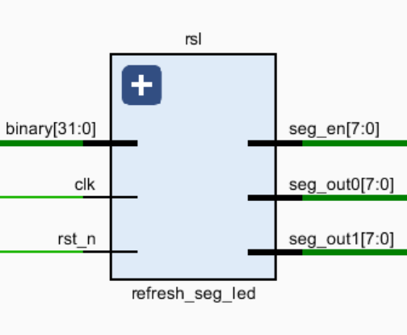

# Simple CPU

## Content

[TOC]

## Developers

- **伦天乐 (12113019)**: 50% work including CPU global design, Top module, PC module, uart module, IMemory module, DMemory module, HWAssistant module and document writing.
- **曹始文 (12113024)**: 50% work including Controller module, IDecoder module, Alu module, Sign_Extend module and PC module.

## CPU Structure Design

### CPU Feature

#### ISA

​	The ISA is based on Minisys ISA and add a systemcall instruction to control hardware. The following picture show the instructions and encoding method of Minisys ISA.


​	The systemcall instruction is 0xFFFFFFFF which will be talked later in bonus part.

#### Registers

​	The registers we used is 32bit register and we have 32 registers including (\$zero, \$at, \$v0-\$v1, \$a0-\$a3, \$t0-\$t7, \$s0-\$s7, \$t8-\$t9, \$k0-\$k1, \$gp, \$fp, \$ra) and one pc register.

#### Exception

​	We do not have any exception in current version but we have a $block\_s$ which is a block signal to handle exception may appear in later version.

#### Addressing Space

​	We use **Harvard Architecture**. We separate the instruction memory and data memory as IMemory and DMemory correspondingly.

​	For both IMemory and DMemory, we use RAM with the same memory parameters. The parameters setting is as following which is in Vivado.


​	The memory unit is 32bit and we use address[15:2] to fetch the memory out. The size of memory is 16384.

#### Hardware

​	We use systemcall instruction to fetch information and control hardware. The details will be mentioned in bonus part.

#### CPU CPI

​	The cpu we designed is single-cycle CPU.

### CPU Interface

​	The clock we used in CPU is 23MHz. The IO ports will be introduced in Top module.

### CPU Modules

#### Top

##### Description

​	The top module. This module is worked as a bridge among all modules in a CPU and hardware.

##### Bus

| Name                           | Type   | Width  | From/To          | Description                                               |
| ------------------------------ | ------ | ------ | ---------------- | --------------------------------------------------------- |
| raw_clock                      | input  | 1      | **Hardware**     | The 100MHz clock.                                         |
| hard_ware_rst                  | input  | 1      | **Hardware**     | The reset signal to switch from uart mode to normal mode. |
| data_switch                    | input  | [7:0]  | **Hardware**     | To read data.                                             |
| confirm_button                 | input  | 1      | **Hardware**     | To confirm something to end the block process.            |
| rx                             | input  | 1      | **Hardware**     | The input for uart module.                                |
| tx                             | output | 1      | **Hardware**     | The output for uart module.                               |
| block_led                      | output | 1      | **Hardware**     | To represent the block signal.                            |
| negative_led                   | output | 1      | **Hardware**     | To represent whether the displayed number is negative.    |
| result_led                     | output | 1      | **Hardware**     | To represent something.                                   |
| seg_en                         | output | [7:0]  | **Hardware**     | The segment led enable signals.                           |
| seg_out0                       | output | [7:0]  | **Hardware**     | The segment led data.                                     |
| seg_out1                       | output | [7:0]  | **Hardware**     | The segment led data.                                     |
| answer_show_led                | output | [7:0]  | **Hardware**     | The binary representation of displayed data.              |
| clk23                          | wire   | 1      | **IPCore** ipclk | 23MHz.                                                    |
| pc_output_address_o            | wire   | [31:0] |                  | Receive output from PC.                                   |
| ifetch_instruction_o           | wire   | [31:0] |                  | Receive output from IFetch.                               |
| controller_RegDst              | wire   | 1      |                  | Receive output from Controller.                           |
| controller_Branch              | wire   | [1:0]  |                  | Receive output from Controller.                           |
| controller_MemRead             | wire   | 1      |                  | Receive output from Controller.                           |
| controller_MemtoReg            | wire   | 1      |                  | Receive output from Controller.                           |
| controller_ALUOp               | wire   | [3:0]  |                  | Receive output from Controller.                           |
| controller_MemWrite            | wire   | 1      |                  | Receive output from Controller.                           |
| controller_ALUSrc              | wire   | 1      |                  | Receive output from Controller.                           |
| controller_RegWrite            | wire   | 1      |                  | Receive output from Controller.                           |
| controller_Jr                  | wire   | 1      |                  | Receive output from Controller.                           |
| controller_Jal                 | wire   | 1      |                  | Receive output from Controller.                           |
| controller_HwtoReg             | wire   | 1      |                  | Receive output from Controller.                           |
| controller_block_ins           | wire   | 1      |                  | Receive output from Controller.                           |
| idecoder_read_data_1           | wire   | [31:0] |                  | Receive output from IDecoder.                             |
| idecoder_read_data_2           | wire   | [31:0] |                  | Receive output from IDecoder.                             |
| alu_zero_s                     | wire   | 1      |                  | Receive output from Alu.                                  |
| alu_result                     | wire   | [31:0] |                  | Receive output from Alu.                                  |
| dmemory_read_data              | wire   | [31:0] |                  | Receive output from DMemory.                              |
| sign_extend_data32             | wire   | [31:0] |                  | Receive output from Sign_Extend                           |
| idecoder_systemcall_argument_1 | wire   | [31:0] |                  | Receive register for systemcall                           |
| idecoder_systemcall_argument_2 | wire   | [31:0] |                  | Receive register for systemcall                           |
| pc_pre_pc_address_o            | wire   | [31:0] |                  | Receive last instruction address for IDecoder.            |
| confirm_signal                 | wire   | 1      |                  | Receive output from key_scan.                             |
| upg_clk                        | wire   | 1      |                  | Uart module                                               |
| upg_clk_o                      | wire   | 1      |                  | Uart module                                               |
| upg_wen_o                      | wire   | 1      |                  | Uart module                                               |
| upg_done_o                     | wire   | 1      |                  | Uart module                                               |
| upg_adr_o                      | wire   | 1      |                  | Uart module                                               |
| upg_dat_o                      | wire   | 1      |                  | Uart module                                               |
| upg_rst                        | wire   | 1      |                  | Uart module                                               |
| rst                            | wire   | 1      |                  | Reset signal for normal mode.                             |
| block_s                        | wire   | 1      |                  | Block signal for PC register                              |
| hwassistant_read_data          | wire   | [31:0] |                  | Data read from Hardware                                   |
| ifetch_upg_wen_o               | wire   | 1      |                  | Control the write for IMemory.                            |
| dmemory_upg_wen_o              | wire   | 1      |                  | Control the write for DMemory.                            |

#### PC

##### Description

​	The module is to handle the PC register transform for new instruction address and control the block process as well.

##### View


##### Bus

| Name           | Type   | Width  | From/To                          | Description                                                  |
| -------------- | ------ | ------ | -------------------------------- | ------------------------------------------------------------ |
| rst            | input  | 1      | **Module** Top                   | Reset signal.                                                |
| clk            | input  | 1      | **Module** Top                   | The clock from IP cores. It is triggered at negative edge.   |
| branch_s       | input  | [1:0]  | **Module** Controller            | Control the multiplexer to select next PC address.           |
| zero_s         | input  | 1      | **Module** Alu                   | Signal the compare result of Alu.                            |
| block_s        | input  | 1      | **Module** Controller            | The block signal for IO.                                     |
| block_ins      | input  | 1      | **Module**  Controller           | The block signal for instruction.                            |
| jump_address26 | input  | [25:0] | **Module** IFetch                | The 26 bits jump address. Used by instruction j, jal.        |
| jump_address32 | input  | [31:0] | **Module** Alu                   | The 32 bit jump address. Used by instruction jr, beq and bnq. |
| address_o      | output | [31:0] | **Module** IFetch, IDecoder, Alu | The new instruction address.                                 |
| pre_address_o  | output | [31:0] | **Module** IDecoder              | The last instruction address.                                |
| PC_reg         | reg    | [31:0] |                                  | The register PC.                                             |
| next_address   | reg    | [31:0] |                                  | The register for next PC address.                            |
| confirm        | reg    | [31:0] |                                  |                                                              |
| confirm_value  | reg    | [31:0] |                                  |                                                              |

#### IFetch

##### Description

​	Fetch the instruction.

##### View


##### Bus

| Name          | Type   | Width  | From/To                                                      | Description                                                |
| ------------- | ------ | ------ | ------------------------------------------------------------ | ---------------------------------------------------------- |
| address_i     | input  | [31:0] | **Module** PC                                                | The instruction address.                                   |
| clk           | input  | 1      | **Module** Top                                               | The clock from IP cores. It is triggered at positive edge. |
| instruction_o | output | [31:0] | **Module** Controller, IDecoder, Sign_Extend, PC, HWAssistant | The fetched instruction.                                   |
| upg_rst_i     | input  | 1      | **Module** Uart                                              | The reset signal from Uart.                                |
| upg_clk_i     | input  | 1      | **Module** Uart                                              | The clock signal from Uart.                                |
| upg_wen_i     | input  | 1      | **Module** Uart                                              | The control signal for Uart to write the IMemory.          |
| upg_adr_i     | input  | [13:0] | **Module** Uart                                              | The address where to write from uart.                      |
| upg_dat_i     | input  | [31:0] | **Module** Uart                                              | The data to write from uart.                               |
| upg_done_i    | input  | 1      | **Module** Uart                                              | The signal of whether Uart rx data have done.              |
| fetch_ins     | wire   | [31:0] |                                                              | Store the instruction which get from the **IMem** IP core. |
| kickOff       | wire   | 1      |                                                              | The signal to check who need to use the  **IMem** IP core. |

#### Controller

##### Description

​	Controller unit, providing signals to modules.

##### View

​	

##### Bus

| Name                  | Type   | Width  | From/To                        | Description                               |
| --------------------- | ------ | ------ | ------------------------------ | ----------------------------------------- |
| opcode                | input  | [5:0]  | **Module** IFetch              | The opcode.                               |
| funct                 | input  | [5:0]  | **Module** IFetch              | The function code.                        |
| systemcall_argument_1 | input  | [31:0] | **Module** IDecoder            | The systemcall instruction argument 1.    |
| block_ins             | output | 1      | **Module** PC, Top             | The block signal for instruction.         |
| block_s               | output | 1      | **Module** PC, Controller, Top | The block signal for IO.                  |
| RegDst                | output | 1      | **Module** IDecoder            | The register destination.                 |
| Branch                | output | [1:0]  | **Module** PC                  | The branch signal.                        |
| MemRead               | output | 1      | **Module** DMemory             | The memory read signal.                   |
| MemtoReg              | output | 1      | **Module** IDecoder            | The signal to select write memory data.   |
| HwtoReg               | output | 1      | **Module** IDecoder            | The signal to select write hardware data. |
| ALUOp                 | output | [3:0]  | **Module** Alu                 | The type of alu operation.                |
| MemWrite              | output | 1      | **Module** DMemory             | The write signal of data memory.          |
| ALUSrc                | output | 1      | **Module** Alu                 | The signal to select the source of alu.   |
| RegWrite              | output | 1      | **Module** IDecoder            | The signal of write register.             |
| Jr                    | output | 1      | **Module** IDecoder            | The signal of instruction jr.             |
| Jal                   | output | 1      | **Module** IDecoder            | The signal of instruction jal.            |

##### ALUOp Table

| Value | Instructions               |
| ----- | -------------------------- |
| 0     | sll, sllv                  |
| 1     | srl, srlv                  |
| 2     | sra, srav                  |
| 3     | add, addi, lw, sw, jr, jal |
| 4     | addu, addiu                |
| 5     | sub                        |
| 6     | subu                       |
| 7     | and, andi                  |
| 8     | or, ori                    |
| 9     | xor, xori                  |
| 10    | nor                        |
| 11    | slt, slti                  |
| 12    | sltu, sltiu                |
| 13    | beq                        |
| 14    | bne                        |
| 15    | lui                        |

#### IDecoder

##### Description

​	Handle the register read and write.

##### View


##### Bus

| Name                  | Type       | Width  | From/To                            | Description                                                |
| --------------------- | ---------- | ------ | ---------------------------------- | ---------------------------------------------------------- |
| rst                   | input      | 1      | **Module** Top                     | Reset signal.                                              |
| clk                   | input      | 1      | **Module** Top                     | The clock from IP cores. It is triggered at positive edge. |
| ins25_21              | input      | [4:0]  | **Module** IFetch                  | Part of instruction for read register.                     |
| ins20_16              | input      | [4:0]  | **Module** IFetch                  | Part of instruction for read register.                     |
| ins15_11              | input      | [4:0]  | **Module** IFetch                  | Part of instruction for read register.                     |
| RegDst                | input      | 1      | **Module** Controller              | The signal to select destination of register.              |
| RegWrite              | input      | 1      | **Module** Controller              | The signal of register write.                              |
| jr                    | input      | 1      | **Module** Controller              | The signal of instruction jr.                              |
| jal                   | input      | 1      | **Module** Controller              | The signal of instruction jal.                             |
| MemtoReg              | input      | 1      | **Module** Controller              | The signal to select data to write.                        |
| HwtoReg               | input      | 1      | **Module** Controller              | The signal of getting write data from hardware.            |
| PC_address            | input      | [31:0] | **Module** PC                      | The current PC register.                                   |
| pre_PC_address        | input      | [31:0] | **Moulde** PC                      | The last PC register.                                      |
| alu_data              | input      | [31:0] | **Module** Alu                     | The potential data to write.                               |
| mem_data              | input      | [31:0] | **Module** DMemory                 | The memory data to write.                                  |
| hw_data               | input      | [31:0] | **Module** HWAssistant             | The hardware data to wirte.                                |
| block_s               | input      | 1      | **Module** Controller              | The block signal for IO.                                   |
| read_data_1           | output     | [31:0] | **Module** Alu                     | The read data 1.                                           |
| read_data_2           | output     | [31:0] | **Module** Alu, DMemory            | The read data 2.                                           |
| systemcall_argument_1 | output     | [31:0] | **Module** Controller, HWAssistant | The systemcall instruction argument 1.                     |
| systemcall_argument_2 | output     | [31:0] | **Module** HWAssistant             | The systemcall instruction argument 2.                     |
| registers             | reg [0:31] | [31:0] |                                    | The registers.                                             |
| write_register        | reg        | [4:0]  |                                    | The address for the write register.                        |
| m                     | integer    | 32     |                                    | Used during the loop to clear all registers.               |

#### Alu

##### Description

​	The module to handle data operation.

##### View


##### Bus

| Name               | Type   | Width  | From/To                          | Description                            |
| ------------------ | ------ | ------ | -------------------------------- | -------------------------------------- |
| read_data_1        | input  | [31:0] | **Module** IDecoder              | The read data from IDecoder.           |
| read_data_2        | input  | [31:0] | **Module** IDecoder              | The read data from IDecoder.           |
| sign_extended_data | input  | [31:0] | **Module** Sign_Extend           | The read data from I type instruction. |
| ALUOp              | input  | [3:0]  | **Module** Controller            | The operation type.                    |
| ALUSrc             | input  | 1      | **Module** Controller            | The signal to select operation data.   |
| PC_address         | input  | [31:0] | **Module** PC                    | The current PC address.                |
| zero_s             | output | 1      | **Module** PC                    | The compare result signal.             |
| result             | output | [31:0] | **Module** PC, DMemory, IDecoder | The result of operation.               |

#### DMemory

##### Description

​	The module to handle data memory operatoin.

##### View


##### Bus

| Name       | Type   | Width  | From/To               | Description                                                |
| ---------- | ------ | ------ | --------------------- | ---------------------------------------------------------- |
| clk        | input  | 1      | **Module** Top        | The clock from IP cores. It is triggered at negative edge. |
| MemRead    | input  | 1      | **Module** Controller | The signal of memory read.                                 |
| MemWrite   | input  | 1      | **Module** Controller | The signal of memory write.                                |
| address_i  | input  | [31:0] | **Module** Alu        | The address of memory.                                     |
| write_data | input  | [31:0] | **Module** IDecoder   | The data to write.                                         |
| read_data  | output | [31:0] | **Module** IDecoder   | The read data from memory.                                 |
| upg_rst_i  | input  | 1      | **Module** Uart       | The reset signal from Uart.                                |
| upg_clk_i  | input  | 1      | **Module** Uart       | The clock signal from Uart.                                |
| upg_wen_i  | input  | 1      | **Module** Uart       | The control signal for Uart to write the DMemory.          |
| upg_adr_i  | input  | [13:0] | **Module** Uart       | The address where to write from uart.                      |
| upg_dat_i  | input  | [31:0] | **Module** Uart       | The data to write from uart.                               |
| upg_done_i | input  | 1      | **Module** Uart       | The signal of whether Uart rx data have done.              |
| kick_off   | wire   | 1      |                       | The signal to check who need to use the  **RAM** IP core.  |

#### Sign_Extend

##### Description

​	Extend data.

##### View


##### Bus

| Name    | Type   | Width  | From/To           | Description                |
| ------- | ------ | ------ | ----------------- | -------------------------- |
| ins15_0 | input  | [15:0] | **Module** IFetch | The data needed to extend. |
| data32  | output | [31:0] | **Module** Alu    | The extended data.         |

#### HWAssistant

##### Description

​	Control the hardware components.

##### View


##### Bus

| Name                  | Type   | Width  | From/To                                                    | Description                                  |
| --------------------- | ------ | ------ | ---------------------------------------------------------- | -------------------------------------------- |
| rst                   | input  | 1      | **Module** Top / **Module** refresh_seg_led, light_control | The reset signal.                            |
| clk100                | input  | 1      | **Module** Top / **Module** refresh_seg_led, light_control | The 100MHz clock.                            |
| instruction           | input  | [31:0] | **Module** IFetch                                          | The instruction.                             |
| data_switch           | input  | [7:0]  | **Module** Top                                             | The switches to represent data.              |
| systemcall_argument_1 | input  | [31:0] | **Module** IDecoder                                        | The systemcall argument 1.                   |
| systemcall_argument_2 | input  | [31:0] | **Module** IDecoder                                        | The systemcall argument 2.                   |
| seg_en                | output | [7:0]  | **Module** Top / **Module** refresh_seg_led                | The segment led enable signal.               |
| seg_out0              | output | [7:0]  | **Module** Top / **Module** refresh_seg_led                | The segment led data.                        |
| seg_out1              | output | [7:0]  | **Module** Top / **Module** refresh_seg_led                | The segment led data.                        |
| result_led            | output | 1      | **Module** Top                                             | The result led signal.                       |
| negative_led          | output | 1      | **Module** Top                                             | The negative led signal.                     |
| read_data             | output | [31:0] | **Module** IDecoder                                        | The data to write to IDecoder.               |
| answer_show_led       | output | [7:0]  | **Module** Top                                             | The binary representation of displayed data. |
| display_number        | reg    | [31:0] | **Module** refresh_seg_led                                 | The displayed number.                        |
| led_type              | reg    | [1:0]  | **Module** light_control                                   | The type of result_led.                      |

#### key_scan

##### Description

​	Used to eliminate button jitter.

##### View


##### Bus

| Name        | Type      | Width  | From/To        | Description                                           |
| ----------- | --------- | ------ | -------------- | ----------------------------------------------------- |
| clk         | input     | 1      | **Module** Top | The 100MHz clock signal.                              |
| key         | input     | 1      | **Module** Top | The confirm button signal.                            |
| key_o       | output    | 1      | **Module** PC  | The confirm button signal after shaking cancellation. |
| cnt_press   | reg       | [31:0] |                | The count of clk when button is pressed.              |
| cnt_release | reg       | [31:0] |                | The count of clk when button is released.             |
| cnt_check   | parameter | 32     |                | Parameter used to solve signal jitter problem.        |

#### refresh__seg_led

##### Description

​	Refresh the segment led.

##### View



##### Bus

| Name     | Type      | Width  | From/To                                             | Description                                                  |
| -------- | --------- | ------ | --------------------------------------------------- | ------------------------------------------------------------ |
| binary   | input     | [31:0] | **Module** HWAssistant                              | The binary representation of the absolute value of the displayed number. |
| clk      | input     | 1      | **Module** HWAssistant                              | The 100MHz clock signal.                                     |
| rst_n    | input     | 1      | **Module** HWAssistant                              | The reset signal.                                            |
| seg_en   | output    | [7:0]  | **Module** HWAssistant                              | The signal of selecting which segment led to show.           |
| seg_out0 | output    | [7:0]  | **Module** HWAssistant / **Module** light_7seg_ego1 | The signal of controlling which light tubes of the four segment led on the right are on. |
| seg_out1 | output    | [7:0]  | **Module** HWAssistant / **Module** light_7seg_ego1 | The signal of controlling which light tubes of the four segment led on the left are on. |
| period   | parameter | 32     |                                                     | Parameter used to divide the frequency.                      |
| i        | integer   | 32     |                                                     | Used during the loop to translate binary to BCD code.        |
| cnt      | reg       | [31:0] |                                                     | The count of clock.                                          |
| clkout   | reg       | 1      |                                                     | The clock signal after frequency division.                   |
| number   | reg       | [3:0]  | **Module** light_7seg_ego1                          | The register used to store the number need to show for the certain segment led. |
| digit    | reg       | [2:0]  |                                                     | The register used to select which segment led to refresh.    |
| bcd_out  | reg       | [31:0] |                                                     | The converted BCD code.                                      |

#### light_7seg_ego1

##### Description

​	Used to refresh certain segment led.

##### View


##### Bus

| Name    | Type   | Width | From/To                    | Description                                       |
| ------- | ------ | ----- | -------------------------- | ------------------------------------------------- |
| number  | input  | [3:0] | **Module** refresh_seg_led | The displayed number for the certain segment led. |
| seg_out | output | [7:0] | **Module** refresh_seg_led | The light tubes for the certain segment led.      |

#### light_control

##### Description

​	Used to show the different types result_led.

##### View


##### Bus

| Name       | Type   | Width  | From/To                | Description               |
| ---------- | ------ | ------ | ---------------------- | ------------------------- |
| clk100     | input  | 1      | **Module** HWAssistant | The 100MHz clock signal.  |
| rst_n      | input  | 1      | **Module** HWAssistant | The reset signal.         |
| led_type   | input  | [1:0]  | **Module** HWAssistant | The type of result_led.   |
| result_led | output | 1      | **Module** HWAssistant | The signal of result_led. |
| cnt        | reg    | [31:0] |                        | The count of the clk100.  |

## Bonus Part

### Systemcall

​	The systemcall instruction is ```0xffffffff```. In this project, we use ```addi $zero, $zero, 12345``` to represent the instruction in the asm files and replace ```0x20003039``` with ```0xffffffff``` in the coe files.

​	The systemcall instruction use register ``$v0`` as the code of systemcall function and \$a0 as the argument for the system call function..

| Code | Description                                             | Arguments                                       | Block |
| ---- | ------------------------------------------------------- | ----------------------------------------------- | ----- |
| 0    | Read signed data to register from switches.             | ```$a0``` - The register to write.              | T     |
| 1    | Read unsigned data to register from switches.           | ```$a0``` - The register to write.              | T     |
| 2    | Show a signed data on the segment tubes and symbol led. | ```$a0``` - The register to get displayed data. | F     |
| 3    | Show a unsigned data on the segment tubes.              | ```$a0``` - The register to get displayed data. | F     |

​	In this part, we add a HWAssistant module which has been mentioned above to fetch and output data from hardware and control hardware. All the operations in this module is not triggered by the clock and it works like Controller module. For detailed information, please refer to the source code and introduction video.

### Uart Module

​	We have realized the uart communication mode by the uart IPCode. We use one switch on the board to switch between normal mode and uart communicate mode. The design of the uart module is following the procedure introduced in the course lab.

### Block

​	We have develop a block scheme which can stop the PC register from moving by detecting instruction that need to block and block signal.

​	When we meet a block instruction signal from controller, for example, reading data from hardware, the PC register will stop moving to next instruction address and continue to repeat the same instruction. When we press the confirm button and get a signal, which has been **filtered** by the key_scan module to get stable signal. The PC module will stop the block and continue to next instruction address. It is worth mentioning that the PC module detects the negative edge of the confirm signal.

​	When we meet a block signal from controller, the PC module will do the same process but this type of block cannot be skip by confirm button.

​	To realize this process, we have a confirm number as authentication for each block process and one confirm signal can only confirm one block process. This process is to prevent the confirm signal to confirm next block process. For clearer understanding, please refer to the source code.

​	To reduce the risk of repeating one instruction, the register write and memory write signal is disabled when the cpu is blocked.

### User Experience

​	The cpu we design is very easy to use and it is also powerful.

​	For users, we have 3 parts to display a number, the segment tubes to display the absolute value of the number to display, 1 led to display the negative signal of the number and **8 led to display the binary representation of the number. In addition, we have block signal to represent whether the cpu is blocked and 1 customized led to represent something, which can be control by instruction. We only use one button to do every confirm task.

​	For developers, we have included all Minisys ISA. The systemcall instruction scheme can access and control hardware in a more powerful and flexible way than MMIO scheme.

